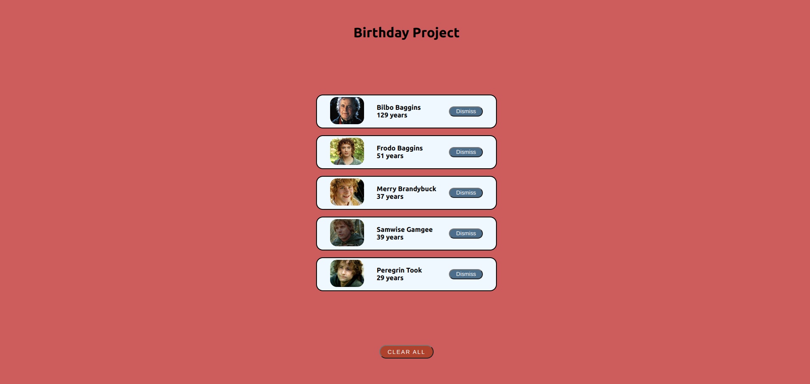

# BIRTHDAY PROJECT

## FULLSTACK REACT PRACTICE PROJECT NO: 1

1. I created this project to practice my skills using Javascript, React, NodeJS, ExpressJS, MongoDB, HTML, CSS.

2. This is a notification page for birthdays.

3. It tries to get the data from the cloud. If it won't be successful it gets the information from the local hobbits.js file.

4. You can dismiss one or all together.